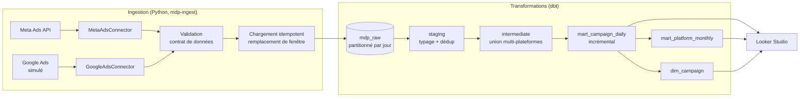

# Architecture

## Vue d'ensemble

## Principes de conception

| Principe | Mise en œuvre |
|---|---|
| **Idempotence** | Une ingestion remplace une fenêtre de dates dans une transaction (`DELETE` + `INSERT`) : rejouer donne le même état ([ADR-0001](adr/0001-chargement-idempotent.md)) |
| **Contrat de données explicite** | Schémas BigQuery déclarés (`schemas.py`), pas d'autodétection ; validation avant tout chargement |
| **Traçabilité** | Chaque ligne raw porte `extract_run_id`, `ingested_at`, `source`, `data_mode` |
| **Aucun repli silencieux** | Mode `real` sans identifiants = erreur ; `data_mode = simulated` propagé jusqu'aux marts ([ADR-0003](adr/0003-donnees-simulees-etiquetees.md)) |
| **Grain unique et testé** | `report_date × campaign_id × platform`, unicité vérifiée à chaque couche |
| **NULL ≠ 0** | Une métrique non suivie par une source est NULL ; les ratios valent NULL si le dénominateur est nul |
| **Testable sans cloud** | Le même projet dbt s'exécute sur DuckDB en CI ([ADR-0002](adr/0002-dbt-duckdb-ci.md)) |

## Couches

### Raw — `mdp_raw`
Une table par source (`meta_ads_campaign_daily`, `google_ads_campaign_daily`), partitionnée par `date`, clusterisée par `campaign_id`. Alimentée uniquement par `mdp-ingest`. Les colonnes sont documentées et testées comme *sources* dbt (avec fraîcheur sur `ingested_at`).

### Staging — `mdp_staging` (vues)
Typage, noms normalisés, **déduplication** : une ligne par `(date, campaign_id)`, la dernière ingestion gagne. Le chargement raw est déjà idempotent ; cette défense évite qu'un chargement manuel ou un ancien mode append ne casse le grain en aval.

### Intermediate — `mdp_intermediate` (vue)
Union des plateformes dans un schéma commun. Les colonnes absentes d'une plateforme (engagement Google, par exemple) sont des NULL typés.

### Marts — `mdp_marts`
- **`mart_campaign_daily`** : table de faits (KPI, engagement, `data_mode`). *Incrémentale*, partitionnée par `report_date`, stratégie `insert_overwrite`, fenêtre glissante de 7 jours pour absorber les corrections tardives des plateformes.
- **`mart_platform_monthly`** : agrégat mensuel ; les ratios sont recalculés depuis les sommes.
- **`dim_campaign`** : nom le plus récent par campagne (une campagne renommée ne se dédouble plus dans la BI).

## Environnements

| Cible dbt | Usage | Jeux de données |
|---|---|---|
| `duckdb` | tests, CI, développement hors ligne | fichier local |
| `dev` | BigQuery, développement | `mdp_dev_staging`, `mdp_dev_marts`… |
| `prod` | BigQuery, déploiement | `mdp_staging`, `mdp_marts`… |

L'authentification BigQuery utilise les *Application Default Credentials* : aucune clé JSON n'est lue par le projet.

## Ce qui n'existe pas encore

Orchestration planifiée, infrastructure décrite en code (Terraform), extraction Google Ads réelle, alertes. Voir la [feuille de route](../README.md#feuille-de-route).
